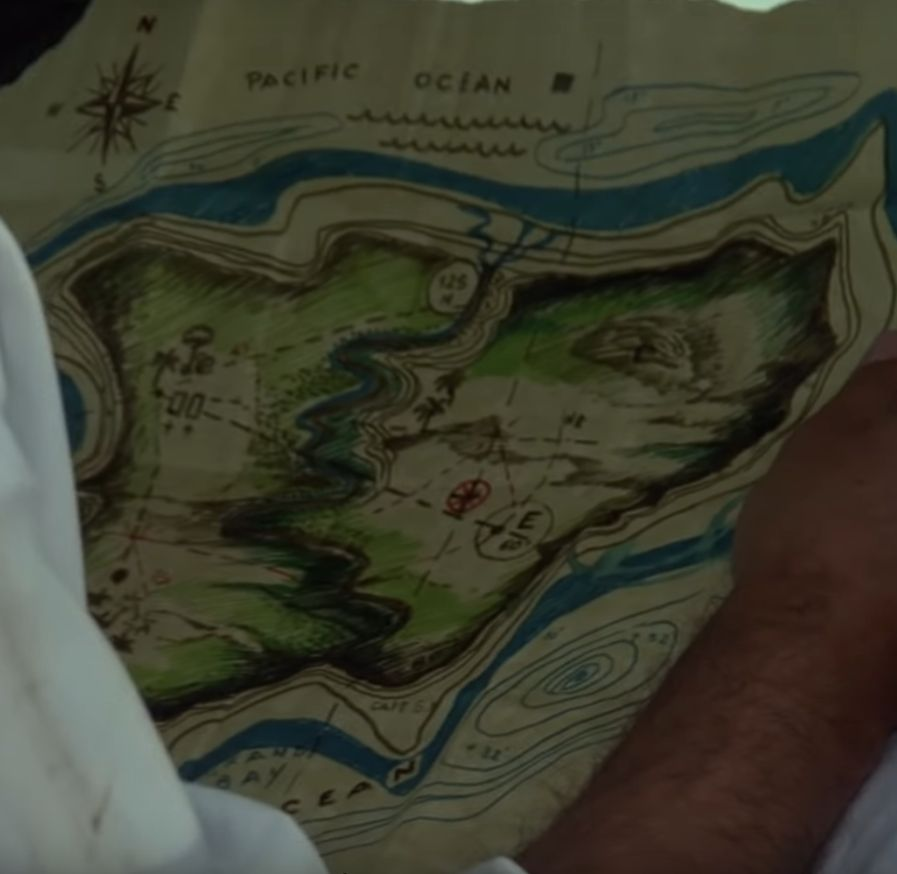
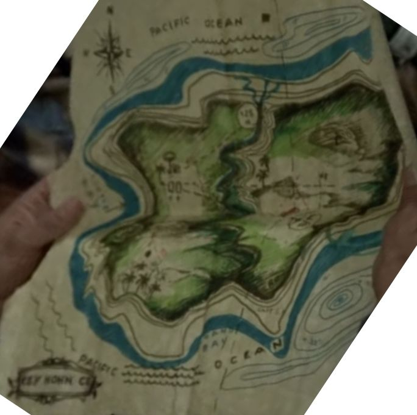
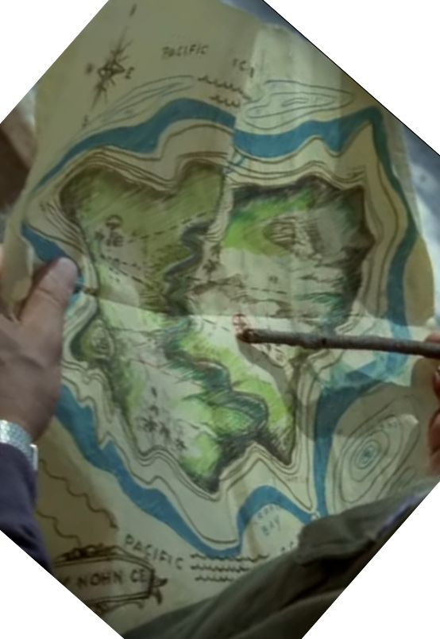

# kocka
  * d4

# mezők
1. Lóversenypálya
  * A Chikagoiak elfizették a futamot és mindent feltettek Filippónéra.
  * Csokoládé az esélyes, Frisco lova, Ő nem veszíthet.
2. futás
  * Szóval a Chikagóiak úgy döntöttek, hogy Csokoládé veszít, mi?
  * A Chikagoi seggfejek pedig tanulják meg végre, hogy Frisco dönti el, hogy ki nyer.
3. Brady háza, csak 2,4-essel (lehet tovább lépni)
 * Hello Éhenkórász! Nos mesélj, hogy tüntetted el a pénzünket?
 * Hogy mit?
4. Éppeverekedés, vissza 3
  * Hé, nem vagy te süket, a 15000 dillárt.
  * De hiszen már megmondtam!
5. kiütés, ugrás 7
  * Hát mit is mondtál már meg nekünk? 
  * Befektettük. Méghozzá nektek fektettem be, bomba üzlet!
6. verekedés, vissza 3
  * Tiétek a bácsikám térképe, a kincsről... csak követni kell az utasításokat.
  * Éppen azért vagyunk itt, hogy eleget tegyünk bizonyos utasításoknak, de azokat Frisco adta.
7. szökés
  * Brady: Halgass ide kisfiam, jobb lesz ha most eltűnsz innen. Fogd, ez a Tiéd.
  * Kösz, de már reggeliztem
8 lovaglás
  * Jaj, dehogy a térkép, benne van a térkép
  * Alan: Hű, rengeteg vÍz van körülötte. Hajót kell szereznem
9. kikötő
  * Biztos benne Mr O'Brien, hogy ki fogja állni a próbált?
  * Csak a puffin ad neked erőt és mindent lebíró akaratot.
10. hajóra szállás
11. vissza 8
  * Pakito: csak a puffin adhat erőt, mi?
  * Dögvész pustít majd a cápák között
12. hajó elbújt
  * Hová lett? Hová lett a babom??
  * Ki tudja? Pakito ártatlan.
13. hajó vissza 3
  * Parancsolj Pakito, a világ legnagyobb beefsteakje, mintha egy viziló combjából lenne.
  * Majd meglátjuk, hogy a mi kis titokzatos bélpoklosunk elcseni-e.
14. tenger, előre 19
  * rádió: Itt a Parti állomás, Charlie van valami újság?
  * Charlie: semmi különös, csak ... a hegyekben szomjas vagyok a tengeren meg éhes.
15. tenger, vissza 9
  * Kit látnak szememim, a láthatatlan ember.
  * Alan: Neeem, valójában Alannak hívnak, örvendek a...
16. tenger
  * Igyekezz a hajóra, ha nem akarsz egy cápa legszebb emléke lenni
  * Micsoda szörnyeteg, mint Ön parancsnok.
17. vissza 9
18. tenger
  * A rádió nem müködik és itt van egy sziget, aminek nem kellene itt lennie.
  * Lehet, hogy nemrég rakták ide
19. tenger
  * Add ide a távcsövet. Na add már.
  * Itt van dobom, kapja el. Jelentem a távcső a tengerben.
20. tenger, vissza 16
  * Vagy az iránytű kergült meg, vagy én hibbantam meg. 
  * Hát persze, ha takarékperselynek használja.
21. part, érkezés
  * Charlie! Parancsnok! Én egy vallomással tartozom önnek...
  * Ha hisz, ha nem, ez a sziget teljesen lakatlan és egyetlen térképen sincs jelezve.
22. katonai raktár, előre 26
  * Egyedül vagyunk egy szigeten, ki akarna golyót röpíteni belém, talán a nénikéd?
  * Nem valószínű, az én nénikém egy ilyet, mint te, még csak le se lőne.
23. erdő
  * Ejha, sok ellenséged lehet ezen a szigeten.
  * Nekem csak egy van: te.
24. erdő
  * Tudod a térkép szerint a kincs egy katinai erődben van elrejtve.
  * Nem, ez egy raktár, mégpedig az ameriaki hadseregé.
25. erdő, vissza 21
  * Hét, ez ehetőnek tűnik. Az van ráírva: csak puffin ad nekem erőt és mindent lebíró akaratot.
  * Dobod el! Látni sem akarom
26. Anulu
  * Job lesz ha vele megyünk.
  * Jössz Anulu fogoly. Mamanak fogoly kettő!
27. falu, Mama
  * Nem hallott egy titkos kincsről, ami ezen a szigeten van?
  * Négy nagy kincsünk van, a napfény a tenger, az öröm és a szerelem
28. párbaj, előre 30
  * Meg kell küzdenetek a törzs vezetőjével
  * Abdaba, harcolni, bululubú, harcolni ambadabá lulubidegy
29. párbaj, vissza 27
  * Az a kövér ember azt mondja, hogy a húgaid nem valami szépek
  * Azt mondja, hogy ketté akar hasíani téged
30. Jönnek a kalózok
  * Kalótok jönni!
  * Rossz emberek, ha barátaink akartok lenni, mentsetek meg minket.
31. verekedés, vissza 30
  * A lányok gyönyörűek.
  * A fiúk kemény kötésűek, de gyávák, mint a nyulak.
32. verekedés
  * Kalóz: Hogy lehet hogy ma egy lelket sem látok itt?
  * Biztosan elrejtőztek a kunyhóikban
31. verekedés
  * Ezek itt ketten biztosan a komkurencia, de majd elveszem a kedvük.
32. ásás a szigeten
  * Anulu mondani nektek nem ásni nagyon közel szamuráj.
  * A bácsikám térképe szerint a kincsnek épp a japám erőd alatt kell lenni
33. páncélautó
  * Mama: Ti megmentettetek minket a kalózoktól, cserébe mi odaadjuk nektek a páncélautót
  * Anulu Páncélauto nem, páncélautó nem.
34. pámcélautó, előre 37 ugrás japán erőd 37
  * Mama: Páncélautó igen.
  * Anulu: Páncélauto igen, páncélautó igen.
35. tank
  * Hé, ellopták belőle a kormánykereket
  * Még annyit sem tudsz, hogy a tankokban botkormány van?
36. kifogyott az üzemanyag, vissza 33
  * Melyik az a kurbli? Parancsnok, ez lesz az?
  * Hát persze hogy ez az, nem látod, hogys kurbli formája van?
37. Kamasuka erődje
  * Vajon miért nem lő ránk?
  * Azért mert az hiszi, hogy japánok vagyunk. Vagy mégsem?
38. ásás
  * Nem bántani! Kamaszukát nem bántani! Kamasuka szép katona. 
  * De most legyőzték, mert csellel támadtak rá.
39. ugrás 42
  * Szamurájok nem léteznek többé, áttértek al elektronikára. Nézd csak mek, Seiko.
  * Seko, de hogyan? Seiko kapitány manapság ilyen órákat gyárt?
40. ásás vissza 37
  * Kamasuka, én egy rejtett kincset keresek, valahol itt kell lennie.
  * Azt hiszem tudom miről beszélsz... 
41. ásás
42. kincs
  * Sok évvel ezelptt ez az ajtó mindig zárva volt és egy őr állt előtte.
  * De most hogy már nem áll előtte senki, bemegyünk
43. Frisco megérkezik
  * Frisco: na végre, itt van Pongo Pongo szigete
  * Akkor tehát megérkeztünk
44. verekedés
45. verekedés, vissza 43
46. verekedés
47. ünnep
48. Charlie szökés
49. Alua, vissza 48
  * Alua, kerüljük a szóvirágokat, mondd meg mit akarsz?
  * Te adni előtte egy csokit.
50. Ulla, vissza 48
  * Ulla nagyon szomoró, hogy látni Charlie elmenni szigetről
  * Előtte Charli adni Ullának egy csókát.
51. Ayola, vissza 48
  * Előtte elmennu, Ayola kérni nagy csocsót Charlie
  * Rendben, megcsocsollak.
52. hidropán
  * Itt a forrestal repülőhép anyahajó. Adja meg a pozíciójét és fényjelét!
  * Sem a pozíciómat, sem a jelemet em ismerem. Meg tudjátok mondani hol vagyok?
53. Frisco bandája kiszabadul
54. Frisco banda leverése
55. Forrestal Anyahajó

# térképek
  
  
  
  
# Zenék
  * Movin' Cruisin' ukulele cover - https://www.youtube.com/watch?v=b7JTcxiFGOE
  * https://www.youtube.com/watch?v=fdjODUtR9HQ
  * https://www.youtube.com/watch?v=ArF2SnodKhk
  * https://www.youtube.com/watch?v=PWQGTIF-cow
## más zenék
  * Buggy - https://www.youtube.com/watch?v=CR0hl9yIiyQ
  
# oldalak
  * https://port.hu/adatlap/film/tv/kincs-ami-nincs--chi-trova-un-amico-trova-un-tesoro/movie-7671
  * https://hu.wikipedia.org/wiki/Kincs,_ami_nincs
  * https://spencerhilldb.de/film.php?film=50

